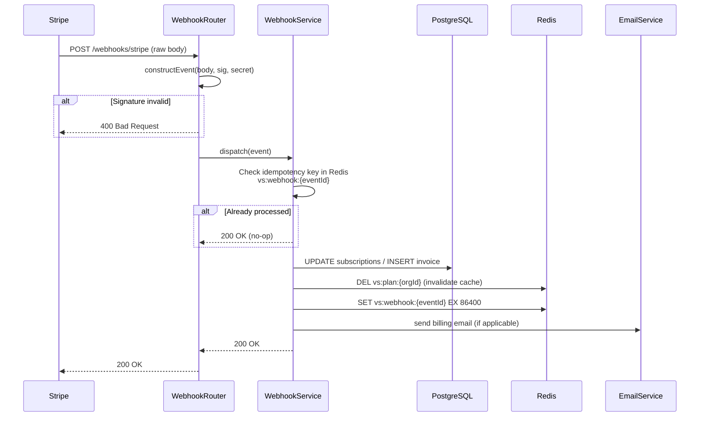

# 02-system-architecture.md
# Billing Architecture — System Architecture

---

## High-Level Architecture

```mermaid
graph TB
    subgraph "Browser"
        FE[Next.js Frontend<br/>app.viralscopes.io]
    end

    subgraph "Fastify API — apps/api"
        BillingRouter[/api/v1/billing/*<br/>BillingRouter]
        WebhookRouter[/api/v1/webhooks/stripe<br/>WebhookRouter]
        UsageMiddleware[UsageMiddleware<br/>quota check + emit]
        PlanGate[PlanGate middleware<br/>requirePlan()]
        BillingService[BillingService]
        UsageService[UsageService]
        WebhookService[WebhookService]
        EmailService[EmailService]
    end

    subgraph "Data Layer"
        PG[(PostgreSQL<br/>self-hosted, Drizzle ORM)]
        REDIS[(Redis<br/>quota counters<br/>plan cache)]
        QUEUE[BullMQ<br/>vs:standard:billing-persist]
    end

    subgraph "External"
        STRIPE[Stripe API]
        STRIPE_WH[Stripe Webhooks]
        SENDGRID[SendGrid / Resend]
    end

    FE -->|POST /billing/checkout| BillingRouter
    FE -->|POST /billing/portal| BillingRouter
    FE -->|GET /usage| BillingRouter
    BillingRouter --> BillingService
    BillingService -->|createCheckoutSession| STRIPE
    BillingService -->|createPortalSession| STRIPE

    STRIPE_WH -->|HTTPS POST + Stripe-Signature| WebhookRouter
    WebhookRouter --> WebhookService
    WebhookService -->|update subscription| PG
    WebhookService -->|invalidate plan cache| REDIS
    WebhookService --> EmailService
    EmailService --> SENDGRID

    UsageMiddleware -->|INCR quota counter| REDIS
    UsageMiddleware -->|enqueue persist job| QUEUE
    QUEUE -->|batch INSERT| PG

    PlanGate -->|GET plan limits| REDIS
    PlanGate -.->|cache miss: load from DB| PG
```

---

## Component Responsibilities

**File paths corrected to match the real codebase convention** (flat `routes/*.routes.ts`, no `v1/` subdirectory — that subdirectory only ever existed in REPOSITORY_STRUCTURE.md's stale aspirational layout, never in the actual tree; versioning is expressed purely via the registered prefix in `server.ts`, exactly like every other route module today).

### BillingRouter (`apps/api/src/routes/billing.routes.ts`)

Thin route layer, registered with prefix `/api/v1/billing`. No business logic. Validates input with an inline Zod schema (matching the existing convention — no shared schemas package), delegates to BillingService.

| Route | Handler |
|---|---|
| `GET /plans` | Returns static plan definitions from `packages/shared/src/plans.ts` |
| `POST /checkout` | Creates Stripe Checkout Session (Owner only) |
| `POST /portal` | Creates Stripe Customer Portal Session (Owner only) |
| `GET /usage` | Returns current-period quota consumption from Redis + limits from plan constants (any authenticated org member) |

### WebhookRouter (`apps/api/src/routes/webhook.routes.ts`)

Receives raw body (not JSON-parsed) for Stripe signature verification. Dispatches to WebhookService.

**Critical:** Fastify's `addContentTypeParser` must register `application/json` on this route with `{ parseAs: 'buffer' }` so the raw body is available for `stripe.webhooks.constructEvent()`.

### BillingService (`apps/api/src/services/billing.service.ts`, `apps/api/src/repositories/billing.repository.ts`)

- Creates Stripe Checkout Sessions with correct `price_id`, `client_reference_id = orgId`, `customer_email`
- Creates Stripe Customer Portal Sessions
- Called by admin override to write directly to `subscriptions`

### WebhookService (`apps/api/src/services/webhook.service.ts`)

- Verifies Stripe signature (delegates to `stripe.webhooks.constructEvent`)
- Dispatches each event type to a dedicated handler function
- Ensures idempotency via `provider_invoice_id` UNIQUE constraint and `provider_subscription_id` lookup
- Logs every processed event to `audit_logs`

### UsageService (`apps/api/src/services/usage.service.ts`)

- `checkQuota(orgId, eventType)`: reads Redis counter; throws `PLAN_LIMIT_EXCEEDED` if over
- `emit(orgId, eventType, quantity, metadata)`: increments Redis counter; enqueues persist job
- `getUsageSummary(orgId)`: returns Redis counters + plan limits for the `GET /usage` response
- `resetCounters(orgId)`: called after subscription renewal to reset period counters

### UsageMiddleware (`apps/api/src/middleware/usage.middleware.ts`)

Fastify hook (`onRequest` + `onSend`) that:
1. On request: calls `UsageService.checkQuota()` for quota-gated endpoints
2. On response (2xx only): calls `UsageService.emit()` to record the usage

Applied per-route, not globally. Each route opts in with `{ preHandler: [authenticate, requirePlan('starter'), checkQuota('video_analyzed')] }`.

**Decision (api_request quota scope):** `api_request` quota tracking is opt-in, the same as every other event type — never applied globally to "any authenticated call." It is further scoped specifically to **API-key-authenticated traffic** (the Professional+ "API access" feature), because that's the only traffic Pricing_Strategy.md's `apiRequestsPerDay` limit actually describes. This is deferred / a no-op until TD-025's API-key request-authentication path exists — today, every request goes through the same JWT-session auth regardless of whether it "counts" as API usage, so there is no way yet to distinguish billable API traffic from normal browser-session traffic. Implementing this middleware against JWT-session traffic instead would double the quota-check cost on every request in the product for a limit that isn't supposed to apply to browser sessions at all.

### PlanGate middleware (`apps/api/src/middleware/plan-gate.middleware.ts`)

```typescript
export function requirePlan(minimumPlan: PlanTier) {
  return async (request: FastifyRequest) => {
    const orgPlan = await getPlanFromCache(request.user.orgId);
    if (PLAN_HIERARCHY[orgPlan] < PLAN_HIERARCHY[minimumPlan]) {
      throw new AppError("PLAN_UPGRADE_REQUIRED",
        `This feature requires the ${minimumPlan} plan or above.`, 402);
    }
  };
}
```

Status code corrected to `402 Payment Required` (a feature not included on the current plan at all — distinct from `PLAN_LIMIT_EXCEEDED`'s `403 Forbidden`, used when a quota *within* an included feature has been exhausted for the period; see `05-api-design.md`'s Error Codes table).

`getPlanFromCache` reads `vs:plan:{orgId}` from Redis (5-minute TTL). On miss, loads from `subscriptions` table + applies grace period logic.

---

## Frontend Components

### Settings → Billing page (`app/(dashboard)/settings/billing/page.tsx`)

- `GET /api/v1/usage` → renders usage bars per event type
- "Manage billing" button → calls `POST /api/v1/billing/portal` → redirects to Stripe URL
- "Upgrade" button (if on free/starter) → calls `POST /api/v1/billing/checkout` → redirects to Stripe

### PlanGate component (`components/common/PlanGate.tsx`)

Already defined in Component_Library.md. Renders `<UpgradePrompt>` when `planTier` from AuthContext is below `requiredPlan`.

### AuthContext plan sync

When a webhook updates the subscription plan, the next API request that hits PlanGate will load the fresh plan from the (now-invalidated) Redis cache. The `planTier` in the JWT becomes stale. To handle this:

**`[ASSUMPTION — requires approval]`** Option A: JWT `planTier` claim is used only as a hint; the definitive check is always Redis/DB. Option B: On plan change, force re-login. **Option A is recommended** — it keeps session UX intact.

---

## Payment Provider (Stripe)

ViralScopes uses Stripe in **Checkout + Customer Portal** mode. We never touch card data.

| Stripe product | Our usage |
|---|---|
| Stripe Checkout (hosted) | New subscriptions |
| Stripe Customer Portal (hosted) | Upgrades, downgrades, cancellation, payment method |
| Stripe Webhooks | All subscription lifecycle events |
| Stripe Invoices (auto) | Auto-created by Stripe; synced to our `invoices` table |
| Stripe Price IDs | 8 prices: Free (no price), Starter monthly/annual, Professional monthly/annual, Business monthly/annual, Enterprise (manual) |

### Stripe configuration required before development

1. Create Products: "ViralScopes Starter", "ViralScopes Professional", "ViralScopes Business"
2. Create Prices: monthly + annual (with 20% discount) for each product
3. Configure Customer Portal: allow plan changes + cancellation
4. Register Webhook endpoint: `https://api.viralscopes.io/api/v1/webhooks/stripe`
5. Select webhook events: `checkout.session.completed`, `customer.created`, `invoice.paid`, `invoice.payment_failed`, `customer.subscription.updated`, `customer.subscription.deleted`
6. Copy Webhook Signing Secret → `STRIPE_WEBHOOK_SECRET`

---

## Webhook Flow



---

## Database Interactions

| Operation | Table(s) | Trigger |
|---|---|---|
| New subscription | `subscriptions` INSERT | `checkout.session.completed` |
| Plan sync | `subscriptions` UPDATE | `customer.subscription.updated` |
| Downgrade to free | `subscriptions` UPDATE (status=canceled) | `customer.subscription.deleted` |
| Invoice record | `invoices` UPSERT | `invoice.paid` / `invoice.payment_failed` |
| Usage persist | `usage_events` INSERT | BullMQ job, every 5 min |
| Plan cache update | — (Redis only) | Webhook processing |
| Audit log | `audit_logs` INSERT | Every billing state change |
| Admin plan override | `subscriptions` UPSERT | `PUT /admin/organisations/:id/plan` |

---

## Redis Key Space (Billing)

| Key pattern | Type | TTL | Purpose |
|---|---|---|---|
| `vs:plan:{orgId}` | Hash | 5 min | Plan limits cache (`{plan, limits, gracePeriodEndsAt}`) |
| `vs:quota:{orgId}:{eventType}:{periodKey}` | String (integer) | Period end + 1 day | Running usage counter |
| `vs:quota:warn:{orgId}:{eventType}:{periodKey}` | String | Period end | Flag: 80% warning email already sent |

Where `periodKey = YYYY-MM` for monthly plans, `YYYY-MM-DD-{startDate}` for annual.

**Decision (idempotency):** the `vs:webhook:{stripeEventId}` Redis key is **removed** from this design. It duplicated the `billing_events` table's UNIQUE `(provider, provider_event_id)` constraint (see `04-database-design.md`) without adding anything a single indexed DB lookup doesn't already give for free — a webhook's traffic volume at this product's scale (see `05-performance-review.md`) never approaches a level where the Postgres lookup is a meaningful cost next to the Stripe API round-trip itself. One durable table is the sole idempotency mechanism; see `06-webhook-design.md`.

---

## n8n Interactions

Phase 9 does **not** introduce new n8n workflows. However, existing workflows are affected:

| Workflow | Change |
|---|---|
| WF-01 Video Discovery | Quota check added: total pending analyses must not exceed `org.limit.videos_per_month` |
| WF-02 Metadata Pipeline | No change |
| WF-09 Viral Score Engine | On complete: calls `UsageService.emit('video_analyzed')` via internal API call |
| All workflows | Priority queue assignment based on plan: Business/Enterprise → `vs:high`, others → `vs:standard` |

**`[ASSUMPTION]`** n8n workflows call back to the Fastify API for usage tracking rather than writing directly to Redis or PostgreSQL. This maintains a single authoritative usage tracking path.

**Cross-phase dependency:** WF-01/WF-09/WF-14 are documented on paper in `n8n_Workflow_Diagrams.md` but not yet built — `infra/n8n-workflows/` currently contains only `foundation-demo.json`, `heartbeat.json`, and `prompt-test.json` (PROJECT_STATUS.md TD-020). The `video_analyzed` usage-emission hook into WF-09 therefore cannot be wired end-to-end until TD-020's real business workflows exist; this is outside Phase 9's own ability to resolve. `export_created` and `api_request` have no such dependency — both correspond to real, existing API-level actions today.

---

## External Services

| Service | Purpose | Auth | Fallback |
|---|---|---|---|
| Stripe API | Checkout, Portal sessions | `STRIPE_SECRET_KEY` bearer | Stripe 99.99% SLA; webhooks retry for 72h |
| Stripe Webhooks | Lifecycle events | HMAC-SHA256 signature | Dead-letter + manual recovery |
| SendGrid / Resend | Billing emails | API key | Retry × 3; log failure |

