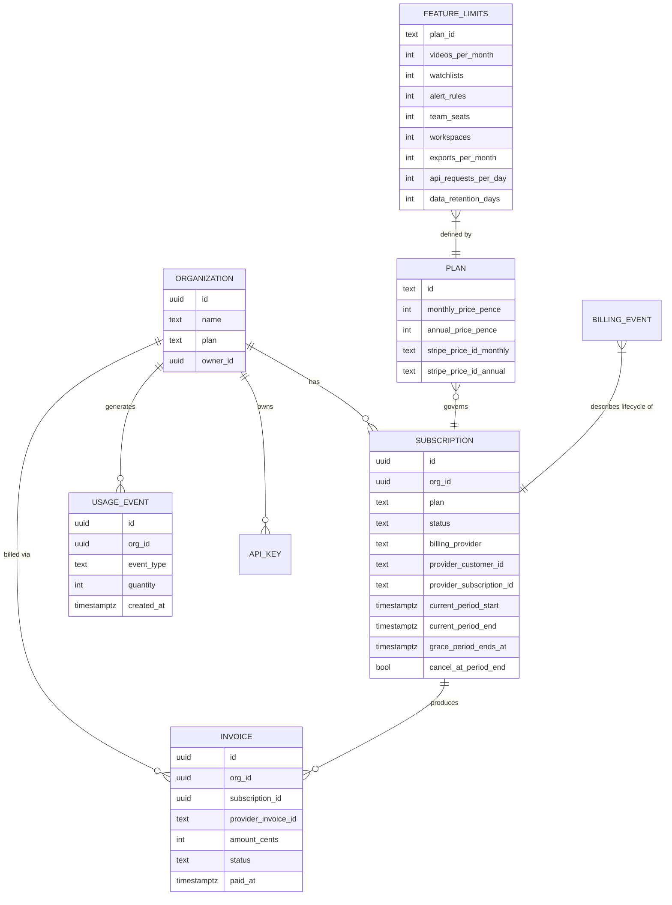

# 03-domain-model.md
# Billing Architecture — Domain Model

---

## Entity Overview



---

## Organization

**Purpose:** Top-level tenant. Every billable resource is owned by an organisation.

**Relationship to billing:** One organisation has at most one _active_ subscription at a time. Historical subscriptions are preserved. The `organizations.plan` column is the **fast-path** for plan lookup (denormalised from `subscriptions.plan`); it is kept in sync by the webhook service.

**Ownership:** Created by the first user who registers a new org. Ownership can be transferred.

**Lifecycle:**
1. Created on user registration (first-time or join-org flow)
2. Defaults to `plan = 'free'`
3. Plan upgrades via Stripe → plan field updated by webhook
4. Deletion: soft-deleted via `deleted_at`; billing stopped by cancelling the Stripe subscription first

**Permissions (decided — sourced directly from Security_Architecture.md's Role Permissions Matrix, "Billing" row):**
- **View** billing/invoices/usage: `owner`, `admin`, Super Admin
- **Initiate billing changes** (upgrade, downgrade, cancel): **`owner` only**, plus Super Admin via the manual admin-override endpoint
- `admin` cannot upgrade/downgrade/cancel — view access only

---

## Subscription

**Purpose:** Represents the billing relationship between an organisation and a payment provider.

**Key fields:**

| Field | Meaning |
|---|---|
| `plan` | Current plan tier (`free`, `starter`, `professional`, `business`, `enterprise`) |
| `status` | Stripe subscription status (`active`, `trialing`, `past_due`, `canceled`, `paused`) |
| `billing_provider` | `stripe` (default), `manual` (admin override), `paddle`/`crypto` (future) |
| `provider_customer_id` | Stripe Customer ID (`cus_xxx`) |
| `provider_subscription_id` | Stripe Subscription ID (`sub_xxx`) |
| `current_period_start/end` | Billing period dates (used for quota reset) |
| `grace_period_ends_at` | Set to `now + 3 days` on `invoice.payment_failed`; null otherwise |
| `cancel_at_period_end` | If true, subscription cancels at `current_period_end` (downgrade intent) |

**Lifecycle:** See `07-subscription-lifecycle.md` for the full state machine.

**One-subscription rule:**
- Free plan: zero or one subscription row with `billing_provider = 'manual'`
- Paid plans: exactly one `active` subscription row per org at any time
- After downgrade: old subscription set to `canceled`; new one inserted (or plan field updated on same row depending on Stripe's behaviour)

**Ownership:** Belongs to one org.

**Permissions (decided, per Security_Architecture.md):**
- Read: `owner`, `admin`, Super Admin
- Write (upgrade/downgrade/cancel trigger): **`owner` only**; webhook service (system) applies the resulting state change; Super Admin (manual override)
- Delete: never deleted — set to `canceled` status

---

## Plan (Constant, not DB table)

**Purpose:** Defines the pricing and feature limits for each tier. Stored as TypeScript constants in `packages/shared/src/plans.ts`, not in the database. This avoids a DB hit on every request and makes plan changes a deploy event (deliberate).

**Decision (plan-limits location):** this is a **promotion of the already-live** `apps/api/src/lib/plan-limits.ts` (`PlanTier`, `PlanLimits`, `PLAN_LIMITS`), not a new parallel definition — that file is imported today by `watchlist.service.ts`, `alert.service.ts`, `api-key.service.ts`, `usage.service.ts`, and `business-rate-limit.ts`. Moving it to `packages/shared` is justified because `apps/web` genuinely needs the same constants (pricing page, `PlanGate` component) at build time. The move **extends** the existing shape — keeps the existing field names (`apiRateLimitPerMinute`/`apiRateLimitPerDay`, not a renamed `apiRequestsPerDay`) and the existing `number | null` "no ceiling" sentinel (not a new `-1` convention) — and every existing `apps/api` call site is updated to import from `packages/shared` instead. There is exactly one `PLAN_LIMITS` constant in the repository after this change, never two.

```typescript
// packages/shared/src/plans.ts
export type PlanTier = 'free' | 'starter' | 'professional' | 'business' | 'enterprise';

export const PLAN_HIERARCHY: Record<PlanTier, number> = {
  free: 0, starter: 1, professional: 2, business: 3, enterprise: 4,
};

export interface PlanDefinition {
  id: PlanTier;
  displayName: string;
  monthlyPricePence: number | null;   // null = Enterprise (custom)
  annualPricePence: number | null;
  stripePriceIdMonthly: string | null;
  stripePriceIdAnnual: string | null;
  limits: FeatureLimits;
}

export const PLANS: Record<PlanTier, PlanDefinition> = {
  free: {
    id: 'free',
    displayName: 'Free',
    monthlyPricePence: 0,
    annualPricePence: 0,
    stripePriceIdMonthly: null,
    stripePriceIdAnnual: null,
    limits: {
      videosPerMonth: 20,
      watchlists: 1,
      alertRules: 2,
      alertChannels: ['email'],
      teamSeats: 1,
      workspaces: 1,
      exportsPerMonth: 0,
      apiRequestsPerDay: 0,
      dataRetentionDays: 30,
      analysisQueue: 'standard',
      scheduledReports: false,
    },
  },
  starter: { ... },
  professional: { ... },
  business: { ... },
  enterprise: { ... },
};
```

**`[ASSUMPTION]`** Stripe Price IDs are injected via environment variables rather than hard-coded constants, to allow staging and production to use different Stripe accounts:

```
STRIPE_PRICE_ID_STARTER_MONTHLY=price_xxx
STRIPE_PRICE_ID_STARTER_ANNUAL=price_yyy
... (8 total)
```

---

## Invoice

**Purpose:** Immutable financial record. Synced from Stripe when `invoice.paid` or `invoice.payment_failed` fires.

**Lifecycle:** Created/updated by the webhook service. Never created by application code.

**Key fields:**

| Field | Meaning |
|---|---|
| `provider_invoice_id` | Stripe invoice ID (`in_xxx`) — UNIQUE constraint ensures idempotency |
| `amount_cents` | Amount in smallest currency unit (pence for GBP) |
| `status` | `paid`, `open`, `void`, `uncollectible` |
| `paid_at` | Timestamp of successful payment |
| `hosted_url` | Link to Stripe-hosted invoice page |
| `pdf_url` | Link to Stripe-generated PDF |

**Ownership:** Belongs to one org. Only `owner`/`admin` can view.

---

## Usage Event

**Purpose:** Immutable append-only record of every quota-consuming action. Written to partitioned `usage_events` table.

**Lifecycle:**
1. Action performed (API call, video analysis, export, etc.)
2. Redis counter incremented synchronously (< 1ms)
3. BullMQ job enqueued to persist to PostgreSQL (async, within 5 minutes)
4. At billing period end: counters reset; old events archived per retention policy

**Event types:**

| Event type | Trigger | Counted toward |
|---|---|---|
| `video_analyzed` | Video passes WF-09 | `videosPerMonth` |
| `api_request` | Any authenticated API call | `apiRequestsPerDay` |
| `export_created` | Export job completed | `exportsPerMonth` |
| `alert_triggered` | Alert dispatched via WF-14 | (informational; not quota-gated in MVP) |
| `search_executed` | `GET /api/v1/search` called | (informational in MVP) |

**Ownership:** Belongs to one org. User ID is optional (can be null for system-triggered events like n8n workflows).

---

## Checkout Session

**Purpose:** Transient. Represents an in-progress Stripe Checkout flow. Not stored in our database — we rely on Stripe's state.

**Lifecycle:**
1. `POST /api/v1/billing/checkout` → `stripe.checkout.sessions.create()` → returns URL
2. User visits Stripe-hosted checkout page
3. User enters card details on Stripe's domain (zero PCI scope on our side)
4. Stripe fires `checkout.session.completed` → our webhook activates the subscription
5. User redirected to `successUrl` (our billing settings page)

**Key metadata we embed in the Checkout Session:**

| Field | Value |
|---|---|
| `client_reference_id` | `orgId` (our internal org UUID) |
| `customer_email` | org owner's email |
| `metadata.org_id` | `orgId` (redundant; for webhook fallback lookup) |
| `metadata.billing_cycle` | `monthly` or `annual` |

---

## Customer (Stripe Customer Object)

**Purpose:** Stripe-side entity that groups all subscriptions and invoices for an organisation. Not stored as a separate table — the Stripe Customer ID is stored in `subscriptions.provider_customer_id`.

**Lifecycle:**
- Created by Stripe when the first Checkout Session completes (or explicitly via `stripe.customers.create`)
- Linked to our org via `customer.created` webhook → store `cus_xxx` in `subscriptions.provider_customer_id`
- One Stripe Customer per org (even if they downgrade and re-subscribe)

**`[ASSUMPTION]`** We do NOT pre-create Stripe Customers at org creation time. A Stripe Customer is only created when the user initiates checkout. This avoids creating customers for orgs that never pay.

---

## Feature Limits

**Purpose:** Defines the maximum allowed quantity per resource per billing period for each plan. Stored as constants in `packages/shared/src/plans.ts` and cached in Redis.

**Enforcement points:**

| Limit | Enforcement location |
|---|---|
| `videosPerMonth` | Redis quota check in `UsageMiddleware`, checked before WF-09 enqueues — **blocked on TD-020** (WF-09 isn't built yet; see `02-system-architecture.md`) |
| `watchlists` | `POST /api/v1/watchlists` → count query before INSERT (extends the count-check already live in `watchlist.service.ts`) |
| `alertRules` | `POST /api/v1/alerts/rules` → count query before INSERT (extends the count-check already live in `alert.service.ts`) |
| `exportsPerMonth` | Redis quota check in `UsageMiddleware` |
| `apiRequestsPerDay` | Redis sliding window, scoped to API-key-authenticated traffic only — **deferred until TD-025** (API-key request-auth path doesn't exist yet); see `08-feature-gating.md` |
| `apiAccess` | `requirePlan('professional')` middleware |
| `alertChannels` | Zod validation on `POST /api/v1/alerts/rules` delivery_channels field |

**Decision (postponed to a later phase, not Phase 9):** `teamSeats` and `workspaces` count-checks are **not** enforced in Phase 9. Both require a multi-seat-invite / multi-workspace flow that has never been built — `org-membership.repository.ts`'s `findActiveOrgContext()` only supports a single membership per user today, by its own explicit comment ("correct for a user with exactly one org ... true of every account this phase can create"). The `teamSeats`/`workspaces` *fields* stay defined in `FeatureLimits` for forward-compatible pricing display; there is no `POST /organisations/invite` or `POST /workspaces` endpoint yet to attach an enforcement check to. Enforcement is added when those features ship.

---

## Billing Events (Audit Log entries)

Every billing state change is written to `audit_logs` with these `action` values:

| Action | Trigger |
|---|---|
| `billing.subscription.created` | Checkout completed; subscription activated |
| `billing.subscription.upgraded` | Plan changed upward |
| `billing.subscription.downgraded` | Plan changed downward |
| `billing.subscription.canceled` | Subscription deleted |
| `billing.subscription.grace_period_started` | Payment failed |
| `billing.subscription.grace_period_ended` | Grace period expired without payment |
| `billing.invoice.paid` | Invoice payment confirmed |
| `billing.invoice.payment_failed` | Invoice payment failed |
| `billing.admin.plan_override` | Admin manually changed plan |
| `billing.quota.warning_sent` | 80% quota warning email sent |

---

## Webhook Events (from Stripe)

| Stripe event | What we do |
|---|---|
| `checkout.session.completed` | Link customer ID to org; activate/create subscription |
| `customer.created` | Store `provider_customer_id` |
| `invoice.paid` | Update invoice record; renew subscription period; send confirmation email |
| `invoice.payment_failed` | Set grace period; send failure email |
| `customer.subscription.updated` | Sync plan, status, period dates, cancel_at_period_end |
| `customer.subscription.deleted` | Downgrade org to free plan; nullify provider IDs |

