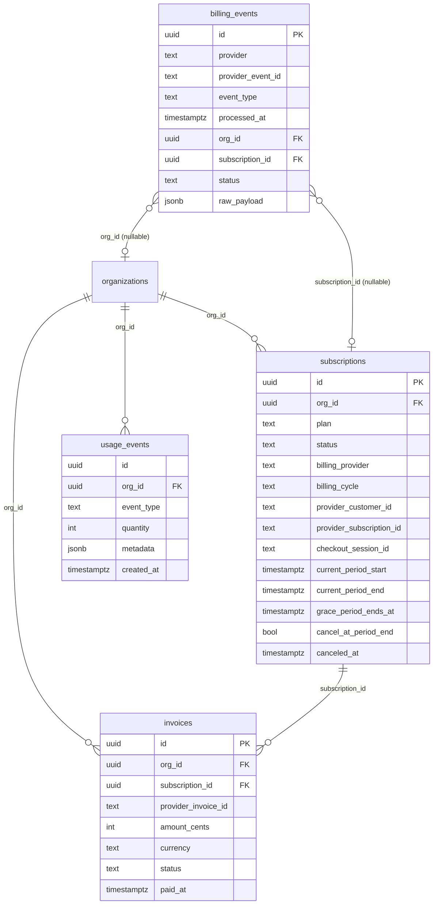

# 04-database-design.md
# Billing Architecture — Database Design

---

## Overview

Phase 9 introduces **no new tables for subscription/invoice data** — those were defined in Phase 3. It introduces exactly **one** new table, for webhook idempotency (see below). This document specifies:

1. The exact column usage and constraints for each billing-related table
2. Missing columns or indexes that must be added via migration
3. The migrations required before billing code can run

**Migration numbering corrected:** the repository's actual latest migration is `packages/db/src/migrations/0009_seed_prompt_library.sql`. Phase 9's migrations are therefore `0010`/`0011`, not `0020`/`0021` as originally drafted (corrected throughout this document and in `12-implementation-plan.md`).

---

## Existing Tables Used by Billing

### `organizations`

Current schema includes `plan TEXT NOT NULL DEFAULT 'free'`. This is the **fast-path** plan lookup.

**Required change:** None. The column already exists.

**Billing usage:** `organizations.plan` is kept in sync with `subscriptions.plan` on every webhook. It is the value cached in Redis and included in JWT claims.

---

### `subscriptions`

Full schema already defined in `Database_Schema.md`. Reproduced here for completeness:

```sql
CREATE TABLE subscriptions (
  id                        UUID        PRIMARY KEY DEFAULT gen_random_uuid(),
  org_id                    UUID        NOT NULL REFERENCES organizations(id),
  plan                      TEXT        NOT NULL
                                        CHECK (plan IN ('free','starter','professional','business','enterprise')),
  status                    TEXT        NOT NULL
                                        CHECK (status IN ('active','trialing','past_due','canceled','paused')),
  billing_provider          TEXT        NOT NULL DEFAULT 'stripe'
                                        CHECK (billing_provider IN ('stripe','paddle','crypto','manual')),
  provider_customer_id      TEXT,
  provider_subscription_id  TEXT,
  current_period_start      TIMESTAMPTZ,
  current_period_end        TIMESTAMPTZ,
  cancel_at_period_end      BOOLEAN     NOT NULL DEFAULT FALSE,
  trial_ends_at             TIMESTAMPTZ,
  grace_period_ends_at      TIMESTAMPTZ,
  canceled_at               TIMESTAMPTZ,
  created_at                TIMESTAMPTZ NOT NULL DEFAULT NOW(),
  updated_at                TIMESTAMPTZ NOT NULL DEFAULT NOW()
);
```

**Gaps identified — require migration:**

1. **No `billing_cycle` column.** We need to know whether the subscription is monthly or annual for analytics, email copy, and downgrade proration logic.

   ```sql
   -- Migration: 0010_add_billing_cycle_to_subscriptions.sql
   ALTER TABLE subscriptions
     ADD COLUMN billing_cycle TEXT
       NOT NULL DEFAULT 'monthly'
       CHECK (billing_cycle IN ('monthly', 'annual'));
   ```

2. **No `stripe_checkout_session_id` column.** We need to correlate `checkout.session.completed` events with pending subscription creation when the subscription doesn't yet exist in our DB.

   ```sql
   -- Included in same migration
   ALTER TABLE subscriptions
     ADD COLUMN checkout_session_id TEXT UNIQUE;
   ```

3. **Missing partial unique index on active subscriptions.** There should be at most one non-canceled subscription per org.

   ```sql
   CREATE UNIQUE INDEX uq_subscriptions_org_active
     ON subscriptions (org_id)
     WHERE status NOT IN ('canceled');
   ```

---

### `invoices`

Full schema already defined. No changes required.

**Billing usage:**
- One row per Stripe invoice
- `provider_invoice_id UNIQUE` constraint provides idempotency
- `status` is updated if Stripe re-sends the event (e.g. invoice goes from `open` to `paid`)

---

### `usage_events`

Full schema already defined. Monthly partitioned. No changes required.

**Billing usage:**
- Written asynchronously by BullMQ worker every 5 minutes
- `event_type` CHECK constraint already covers all MVP event types
- Period retention: 13 months (as defined)

---

### `audit_logs`

No changes required. Billing events write rows with the `action` values defined in `03-domain-model.md`.

---

## New Table Required: `billing_events`

**Decision (idempotency — consolidated to a single mechanism):** the earlier draft of this document used four overlapping idempotency mechanisms (a Redis TTL key, this table, `checkout_session_id` UNIQUE, and an ad-hoc `vs:pending_customer:*` Redis key for out-of-order `customer.created` events). All webhook-level idempotency now runs through **this one durable table**, keyed on `(provider, provider_event_id)`. The per-entity UNIQUE constraints on `subscriptions.checkout_session_id` and `invoices.provider_invoice_id` remain — those aren't a competing idempotency mechanism, they're the natural consequence of UPSERT semantics on those entities' own natural keys. The Redis TTL key is removed (redundant with an indexed DB lookup at this product's webhook volume; see `docs/reviews/billing/05-performance-review.md`). Out-of-order `customer.created` arrival is handled with the same DB-lookup-with-retry pattern already designed for the `checkout.session.completed` race condition (R1), not a bespoke Redis key.

**Why this table, not just the existing per-entity UNIQUE constraints:** those work for `invoice.*` events but not for `customer.subscription.updated`, which can fire multiple times for the same subscription with different data and has no natural per-event UNIQUE key of its own. A durable record keyed on Stripe's own event ID is necessary.

**Naming corrected to be provider-agnostic:** `subscriptions.billing_provider` already treats `stripe` as one of four values (`stripe`, `paddle`, `crypto`, `manual`) — a table literally named `stripe_webhook_events` wouldn't generalize if Paddle arrives in v1.5 per this document's own Future Expansion table. Named `billing_events` instead, with the existing `provider` column doing the differentiation, exactly like `subscriptions`/`invoices` already do.

**RLS justification corrected:** this is the same "identity must be looked up before tenant context exists" problem migrations `0006`/`0007` already solved for `sessions`, `oauth_accounts`, and `organization_members` — a webhook payload references a Stripe customer/subscription ID, and the org it belongs to is only discoverable by looking that ID up, which happens before any tenant context exists for the request (a webhook isn't an authenticated, org-scoped request at all). This table is reclassified into that same established "root identity table, filtered by application logic, no RLS" category — not compared to `job_logs`, which solves an unrelated problem.

```sql
-- Migration: 0010_billing_events.sql

CREATE TABLE billing_events (
  id                UUID        PRIMARY KEY DEFAULT gen_random_uuid(),
  provider          TEXT        NOT NULL DEFAULT 'stripe',
  provider_event_id TEXT        NOT NULL,          -- e.g. evt_xxx
  event_type        TEXT        NOT NULL,          -- e.g. 'invoice.paid'
  processed_at      TIMESTAMPTZ NOT NULL DEFAULT NOW(),
  org_id            UUID        REFERENCES organizations(id),
  subscription_id   UUID        REFERENCES subscriptions(id),
  status            TEXT        NOT NULL DEFAULT 'processed'
                                CHECK (status IN ('processed', 'failed', 'skipped')),
  error_message     TEXT,
  raw_payload       JSONB       NOT NULL DEFAULT '{}',  -- stored for debugging/replay
  CONSTRAINT uq_billing_events_provider_event_id UNIQUE (provider, provider_event_id)
);

-- No separate index on provider_event_id: Postgres automatically indexes
-- the UNIQUE constraint above; a second explicit index would be redundant.
CREATE INDEX idx_billing_events_org_id ON billing_events (org_id);
CREATE INDEX idx_billing_events_processed_at ON billing_events (processed_at DESC);
```

**Data retention:** 90 days. Purge mechanism: the same BullMQ repeatable job used for grace-period expiry (see `07-subscription-lifecycle.md`'s resolved CRON decision) runs a second scheduled task, not an unspecified "CRON job."

**RLS:** None — see justification above. Access is via the service-role DB connection only, filtered explicitly by `org_id`/`subscription_id` once resolved, matching the compensating-control pattern already established for `sessions`.

---

## Migration Plan

All migrations follow the existing zero-downtime pattern from `Database_Schema.md §14`.

| Migration file | Change | Downtime? |
|---|---|---|
| `0010_add_billing_cycle_to_subscriptions.sql` | ADD COLUMN `billing_cycle` (nullable, then backfill, then NOT NULL) | Zero |
| `0010_add_billing_cycle_to_subscriptions.sql` | ADD COLUMN `checkout_session_id` UNIQUE | Zero |
| `0010_add_billing_cycle_to_subscriptions.sql` | CREATE UNIQUE INDEX CONCURRENTLY `uq_subscriptions_org_active` | Zero |
| `0011_billing_events.sql` | CREATE TABLE `billing_events` | Zero |

**Migration 0010 detail (safe ADD COLUMN pattern):**

```sql
-- 0010_add_billing_cycle_to_subscriptions.sql
-- Up

-- Step 1: Add as nullable (instant, no lock)
ALTER TABLE subscriptions ADD COLUMN billing_cycle TEXT;
ALTER TABLE subscriptions ADD COLUMN checkout_session_id TEXT;

-- Step 2: Backfill existing rows (all existing subscriptions are monthly)
UPDATE subscriptions SET billing_cycle = 'monthly' WHERE billing_cycle IS NULL;

-- Step 3: Add NOT NULL constraint (fast when no nulls exist)
ALTER TABLE subscriptions ALTER COLUMN billing_cycle SET NOT NULL;
ALTER TABLE subscriptions ALTER COLUMN billing_cycle SET DEFAULT 'monthly';

-- Step 4: Add CHECK constraint
ALTER TABLE subscriptions ADD CONSTRAINT chk_billing_cycle
  CHECK (billing_cycle IN ('monthly', 'annual'));

-- Step 5: Add UNIQUE on checkout_session_id
ALTER TABLE subscriptions ADD CONSTRAINT uq_checkout_session_id
  UNIQUE (checkout_session_id);

-- Step 6: Add partial unique index (CONCURRENTLY = no table lock)
CREATE UNIQUE INDEX CONCURRENTLY uq_subscriptions_org_active
  ON subscriptions (org_id)
  WHERE status NOT IN ('canceled');

-- Down

DROP INDEX CONCURRENTLY uq_subscriptions_org_active;
ALTER TABLE subscriptions DROP CONSTRAINT IF EXISTS uq_checkout_session_id;
ALTER TABLE subscriptions DROP CONSTRAINT IF EXISTS chk_billing_cycle;
ALTER TABLE subscriptions DROP COLUMN IF EXISTS billing_cycle;
ALTER TABLE subscriptions DROP COLUMN IF EXISTS checkout_session_id;
```

---

## ER Diagram (Billing Subset)



---

## Row Level Security

**Corrected:** this project does not use Supabase Auth — there is no `authenticated` Postgres role and no `auth.uid()` function. RLS here is enforced via `current_setting('app.current_org_id', true)::uuid` / `current_setting('app.current_user_id', true)::uuid`, set per-transaction by `withTenant()` (`packages/db/src/client.ts`), which the app's own custom JWT/session system populates — not Supabase's session model.

| Table | RLS enabled | Policy |
|---|---|---|
| `subscriptions` | Yes — **already exists, no change needed** | `subscriptions_tenant_isolation`, `FOR ALL USING/WITH CHECK (org_id = current_setting('app.current_org_id', true)::uuid)`, defined in migration `0003_rls_policies.sql` |
| `invoices` | Yes — **already exists, no change needed** | Same pattern as `subscriptions`, migration `0003_rls_policies.sql` |
| `usage_events` | Yes — **already exists, no change needed** | Same pattern, migration `0003_rls_policies.sql` |
| `billing_events` | No | Root identity table, filtered by application logic once `org_id` is resolved — see justification above (same category as `sessions`/`oauth_accounts`/`organization_members`, migrations `0006`/`0007`) |

**No new RLS work is required for Phase 9.** `subscriptions` and `invoices` already carry a correct, tested tenant-isolation policy from migration `0003` — the app connects as the restricted `app_user` role (not a superuser, not a Supabase `authenticated` role), so this isolation is already enforced today, independent of anything Phase 9 adds.

