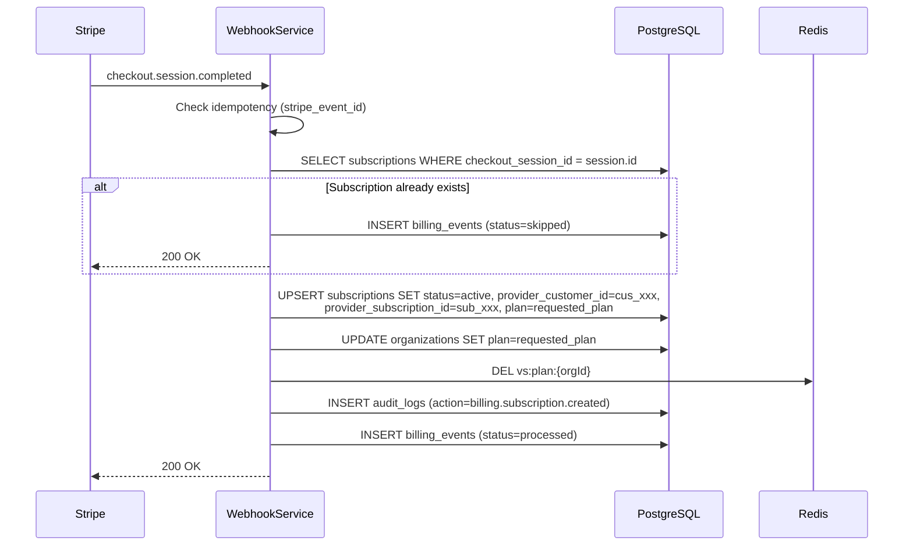
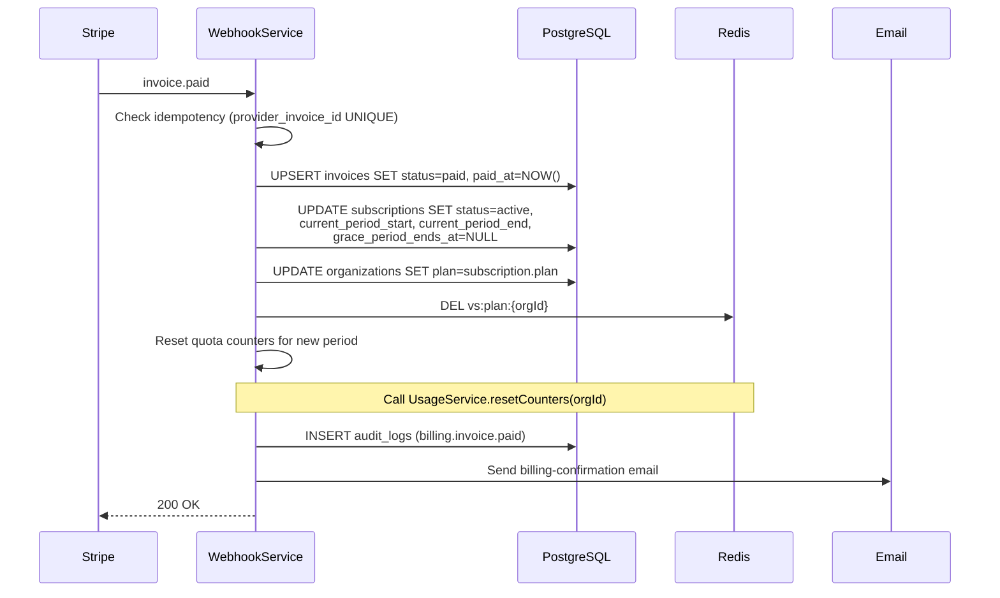
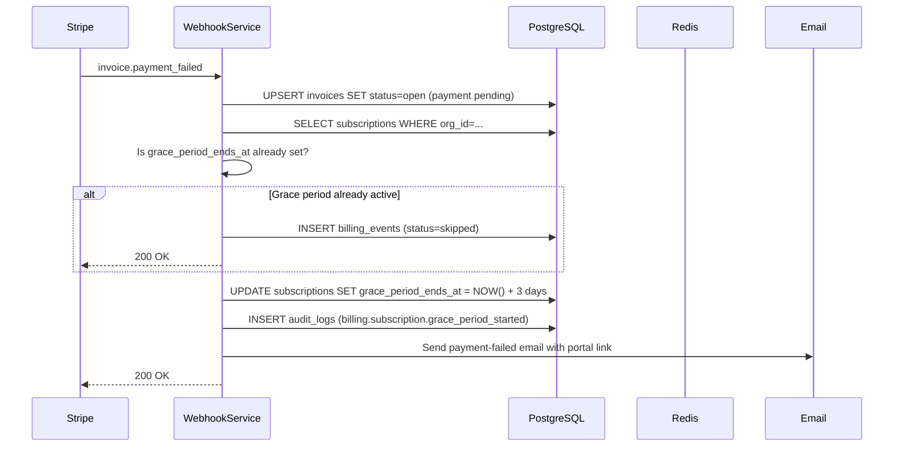

# 06-webhook-design.md
# Billing Architecture — Webhook Design

---

## Overview

Stripe webhooks are the authoritative source of truth for subscription state. We never trust return URLs alone. Every subscription state change must arrive via a webhook before we act on it.

**Webhook endpoint:** `POST /api/v1/webhooks/stripe` (registered at `apps/api/src/routes/webhook.routes.ts`, no `v1/` subdirectory — see `02-system-architecture.md`)
**Verification:** HMAC-SHA256 via `stripe.webhooks.constructEvent(rawBody, signature, secret)`
**Idempotency (decided — single mechanism, not dual-layer):** `billing_events` table, UNIQUE `(provider, provider_event_id)`. The Redis TTL key from the earlier draft is removed — it duplicated this table's job without adding anything a single indexed DB lookup doesn't already give for free at this product's webhook volume (see `docs/reviews/billing/05-performance-review.md`).

---

## Event Handlers

### 1. `checkout.session.completed`

**Source:** User completes Stripe Checkout
**Trigger:** Payment method collected and validated by Stripe



**Key data extracted from event:**
- `session.client_reference_id` → our `orgId`
- `session.customer` → Stripe Customer ID
- `session.subscription` → Stripe Subscription ID
- `session.metadata.billing_cycle` → `monthly` or `annual`
- `session.metadata.org_id` → fallback if `client_reference_id` is missing

**Idempotency:** If `subscriptions.checkout_session_id` already equals `session.id`, skip and return 200.

---

### 2. `customer.created`

**Source:** Stripe creates a customer object (fires alongside checkout.session.completed)

**Processing:**
1. Find org via `provider_customer_id` lookup — if already set, no-op
2. UPDATE `subscriptions SET provider_customer_id = cus_xxx`

**Note (decided — reuses the existing race-condition pattern instead of a bespoke Redis key):** This event often arrives *before* `checkout.session.completed`. The subscription row may not exist yet. Rather than a one-off `vs:pending_customer:*` Redis key (removed — a fifth idempotency mechanism the design didn't need), this is handled with the same DB-lookup-with-retry pattern already used for R1 (`checkout.session.completed` arriving before our own API has written `checkout_session_id`): if no matching `subscriptions` row is found by `provider_customer_id` or `checkout_session_id`, retry with a short backoff (up to 3 attempts, 5s apart) before giving up and writing a `skipped` `billing_events` row for manual reconciliation.

---

### 3. `invoice.paid`

**Source:** Successful payment collected for a subscription period



**Quota reset on renewal:** When `invoice.paid` fires for a renewal (not the first invoice), call `UsageService.resetCounters(orgId)` which deletes all `vs:quota:{orgId}:*:{previousPeriodKey}` Redis keys.

**Grace period clearance:** If `grace_period_ends_at` was set (payment was previously overdue), clear it: `UPDATE subscriptions SET grace_period_ends_at = NULL`.

**Idempotency:** `invoices.provider_invoice_id UNIQUE` prevents duplicate rows. If the row exists and `status = 'paid'`, emit `INSERT billing_events (status=skipped)` and return 200.

---

### 4. `invoice.payment_failed`

**Source:** Stripe could not collect payment



**Grace period calculation:** `grace_period_ends_at = NOW() + INTERVAL '3 days'`

**Email content:** Include link to Stripe Customer Portal to update payment method. Include the invoice amount and due date.

---

### 5. `customer.subscription.updated`

**Source:** Subscription plan, status, or period changed (upgrade, downgrade, cancellation scheduled)

**Processing:**
1. Load org via `provider_subscription_id`
2. If plan changed: UPDATE `subscriptions.plan` + `organizations.plan`; invalidate Redis cache
3. Sync all fields: `status`, `current_period_start`, `current_period_end`, `cancel_at_period_end`, `trial_ends_at`
4. If `cancel_at_period_end` changed to `true`: log `billing.subscription.downgraded` (pending)
5. INSERT `billing_events` for idempotency

**Idempotency:** `billing_events.(provider, provider_event_id) UNIQUE`. If same event ID already processed, skip.

---

### 6. `customer.subscription.deleted`

**Source:** Subscription actually cancelled (period ended with cancel_at_period_end=true, or admin hard-cancels)

**Processing:**
1. UPDATE `subscriptions SET status='canceled', canceled_at=NOW()`
2. UPDATE `organizations SET plan='free'`
3. Clear `provider_subscription_id` from subscription record (keep `provider_customer_id` for re-subscribe)
4. Invalidate Redis plan cache
5. INSERT `audit_logs (billing.subscription.canceled)`
6. **Do NOT send email here** — Stripe already sends its own cancellation confirmation email

**Access:** Org immediately moves to free plan limits. Features above Free tier become unavailable.

---

## Retry Strategy

Stripe retries failed webhooks with exponential backoff for up to 72 hours:

| Attempt | Delay from first attempt |
|---|---|
| 1 | Immediate |
| 2 | 5 minutes |
| 3 | 30 minutes |
| 4 | 2 hours |
| 5 | 5 hours |
| 6 | 10 hours |
| 7 | 24 hours |
| 8 | 72 hours |

**Our obligation:** Return `200 OK` for all successfully-signature-verified events, even if our processing fails. Never return 5xx to Stripe (causes unnecessary retries). Log failures internally.

**If processing fails after signature verification:** Write to `billing_events` with `status = 'failed'`, write to `dead_letter_jobs`, send admin Slack alert. Admin can then retry via `POST /admin/dead-letter/:id/retry`.

---

## Failure Handling

| Failure scenario | Response to Stripe | Internal action |
|---|---|---|
| Invalid signature | `400 Bad Request` | Log warning; no internal action |
| DB write fails | `200 OK` | Write to `dead_letter_jobs`; admin alert |
| Email send fails | `200 OK` | Log error; retry × 3 via BullMQ |
| Unknown event type | `200 OK` | Log as info; no action |
| Org not found for event | `200 OK` | Log warning; write to `billing_events (status=skipped)` |

---

## Audit Logging

Every processed webhook event writes to `audit_logs`:

```typescript
await auditLog({
  orgId: subscription.orgId,
  userId: null,             // system action
  action: 'billing.invoice.paid',
  resourceType: 'subscription',
  resourceId: subscription.id,
  metadata: {
    stripeEventId: event.id,
    invoiceId: invoice.id,
    amountCents: invoice.amount_paid,
    plan: subscription.plan,
  },
});
```
