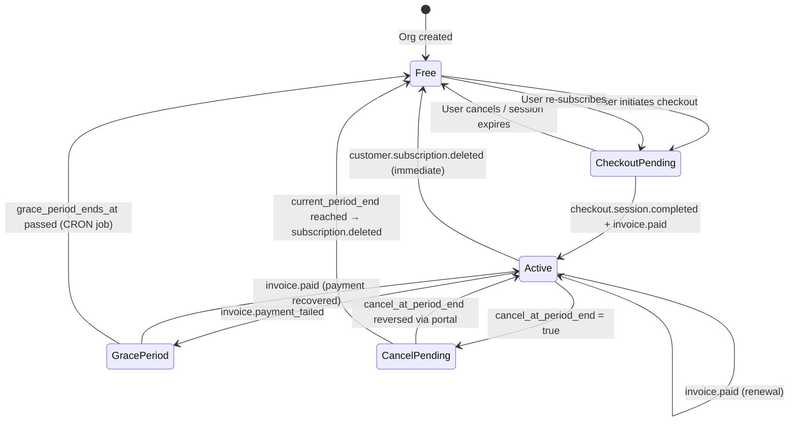

# 07-subscription-lifecycle.md
# Billing Architecture — Subscription Lifecycle

---

## State Machine



**Subscription status values in DB:**

| `status` | Meaning |
|---|---|
| `active` | Paid and current |
| `trialing` | (Reserved; no trial in MVP) |
| `past_due` | **Set by our own BullMQ job when `grace_period_ends_at` has passed** — not the moment Stripe first reports a failed charge. Stripe's own webhook (`invoice.payment_failed`) fires immediately on the first failed charge, before our 3-day grace period even starts; our `status` column doesn't change to `past_due` until the grace period we grant on top of that has actually expired. Treated as Free once set. |
| `canceled` | Subscription ended |
| `paused` | (Reserved for future pause feature) |

**Grace period** is represented by `grace_period_ends_at` being non-null while `status = 'active'`. The feature gating layer checks this field.

---

## Signup Flow

```
1. User registers → org created with plan = 'free'
2. User visits /onboarding/choose-plan
3. User selects Starter/Professional/Business → POST /billing/checkout
4. API creates Stripe Checkout Session → returns checkoutUrl
5. User completes payment on Stripe-hosted page
6. Stripe fires checkout.session.completed
7. WebhookService activates subscription → org.plan updated
8. User redirected to /settings/billing?checkout=success
9. Frontend reads updated plan from next API request (JWT still has old plan claim)
10. On next JWT refresh: new planTier claim reflects upgrade
```

**JWT stale plan handling:** The JWT `planTier` claim reflects `organizations.plan` at the time of login or refresh. After checkout, the plan updates via webhook. On the next request that hits PlanGate, Redis cache is checked — if the webhook has already invalidated the cache, the correct plan is loaded. If not (race condition within seconds), the old plan is used briefly. This is acceptable — the customer's plan is correct within 5 minutes at most.

---

## Trial Period

**MVP:** No trial period implemented. The Free plan serves as the permanent trial.

**Future (v1.5):** Stripe-managed trial with `trial_period_days` on the price. `status = 'trialing'` is already in the schema check constraint.

---

## Upgrade Flow

```
1. User on Starter wants to upgrade to Professional
2. POST /billing/checkout { plan: 'professional', billingCycle: 'monthly' }
   OR
   POST /billing/portal → redirects to Stripe Customer Portal
   (Customer Portal is the recommended path for plan changes)
3. Stripe handles proration automatically
4. Stripe fires customer.subscription.updated
5. WebhookService updates subscriptions.plan + organizations.plan
6. Redis plan cache invalidated
7. New features available immediately on next request
```

**Proration:** Stripe handles automatically. We display "Switch to annual" in the UI (POST /billing/checkout with annual price), which Stripe prices immediately with credit for remaining days.

---

## Downgrade Flow

Downgrades happen exclusively through the Stripe Customer Portal.

```
1. User visits Customer Portal via POST /billing/portal
2. User selects lower plan on Stripe portal
3. Stripe schedules cancellation of current subscription at period end
4. Stripe fires customer.subscription.updated with cancel_at_period_end = true
5. WebhookService: UPDATE subscriptions SET cancel_at_period_end = true
6. UI shows "Your plan will change to [lower plan] on [date]"
7. At period end: Stripe fires customer.subscription.deleted
8. WebhookService: org downgraded to Free (or new plan if re-subscribed)
```

**Access during downgrade pending:** User retains current plan features until `current_period_end`.

---

## Cancellation Flow

```
1. User requests cancellation via Customer Portal
2. Options: Cancel immediately OR Cancel at period end
3a. Cancel immediately:
    - Stripe fires customer.subscription.deleted
    - Org → Free immediately
3b. Cancel at period end:
    - Stripe fires customer.subscription.updated (cancel_at_period_end = true)
    - At period end: subscription.deleted → Org → Free
4. We do NOT send our own cancellation email (Stripe sends one)
5. We log billing.subscription.canceled to audit_logs
```

---

## Payment Failure Flow

```
1. Stripe attempts renewal charge → card declined
2. Stripe fires invoice.payment_failed
3. WebhookService:
   - Sets grace_period_ends_at = NOW() + 3 days
   - Sends payment-failed email with portal link
4. Stripe retries payment (3 retries over next 7 days per Stripe's Smart Retries)
   4a. Payment succeeds → invoice.paid
       - grace_period_ends_at = NULL
       - org remains on paid plan
       - Billing confirmation email sent
   4b. All retries exhausted (Stripe fires customer.subscription.deleted after configured days)
5. If grace_period_ends_at is passed and subscription still not paid:
   **Decision (grace-period expiry mechanism):** a **BullMQ repeatable job** (`apps/api/src/lib/queue.ts` already runs workflow-dispatch queues today; this is the first use of BullMQ's repeatable-job feature, registered via `queue.add(name, {}, { repeat: { pattern: '0 6 * * *' } })`), not an n8n scheduled workflow — this keeps the mechanism in-process, using infrastructure already proven in this codebase, rather than requiring a new n8n workflow to be built just for an internal billing maintenance task (n8n's own WF-01 "CRON + manual" pattern was considered and rejected for this reason). Daily at 06:00 UTC, the job:
   - SELECT subscriptions WHERE grace_period_ends_at < NOW() AND status = 'active'
   - UPDATE status = 'past_due'
   - UPDATE organizations.plan = 'free'
   - Invalidate Redis cache
   - Log billing.subscription.grace_period_ended

   The same repeatable job also runs the `billing_events` 90-day retention purge (see `04-database-design.md`) as a second scheduled task, rather than a separate unspecified mechanism.
```

**Grace period enforcement:** The feature gating layer checks `grace_period_ends_at`:

```typescript
async function getPlanForGating(orgId: string): Promise<PlanTier> {
  const cached = await redis.hgetall(`vs:plan:${orgId}`);
  
  if (cached.gracePeriodEndsAt) {
    const expired = new Date(cached.gracePeriodEndsAt) < new Date();
    if (expired) return 'free';
  }
  
  return (cached.plan as PlanTier) ?? 'free';
}
```

---

## Renewal Flow

```
1. Stripe auto-renews subscription at current_period_end
2. Charges the stored payment method
3. Fires invoice.paid
4. WebhookService:
   - Updates current_period_start, current_period_end
   - Calls UsageService.resetCounters(orgId) → deletes old Redis quota keys
   - Sends billing-confirmation email
   - Logs billing.invoice.paid
5. Quota counters start fresh for new period
```

---

## Refund Flow

Refunds are handled entirely in the Stripe Dashboard. We do not initiate refunds via API in Phase 9.

```
1. Customer contacts support requesting refund
2. Support agent issues refund in Stripe Dashboard
3. Stripe fires invoice.updated (status = 'void') or charge.refunded
   [We do not handle these events in MVP]
4. Support agent manually updates org plan via admin override if needed
```

**`[OPEN QUESTION]`** Should we listen to `charge.refunded` and automatically downgrade the org? Or is manual admin action sufficient for MVP?

---

## Expired Payment Method Flow

```
1. Stripe notifies customer of expiring card via email (Stripe managed)
2. Customer updates via Customer Portal
3. If card expires and renewal fails → Payment Failure Flow above
```

---

## Admin Plan Override Flow

```
1. Support ticket: "Give @maya_chen 3 months free Professional"
2. Super Admin calls PUT /admin/organisations/:id/plan
   { plan: 'professional', reason: '...', expiresAt: '2026-10-28' }
3. BillingService:
   - UPSERT subscriptions (billing_provider = 'manual', status = 'active')
   - UPDATE organizations.plan = 'professional'
   - DEL vs:plan:{orgId}
   - Enqueue delayed BullMQ job: revert to 'free' at expiresAt
4. audit_logs: billing.admin.plan_override
```

