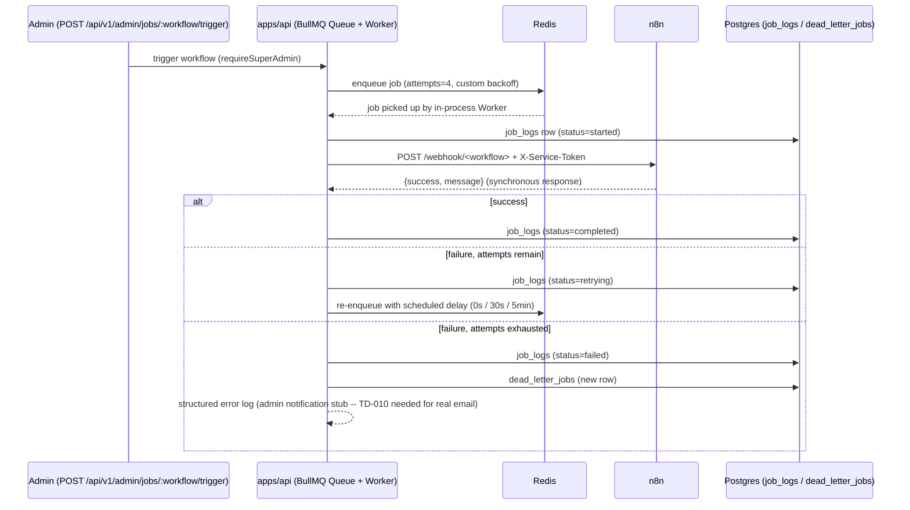
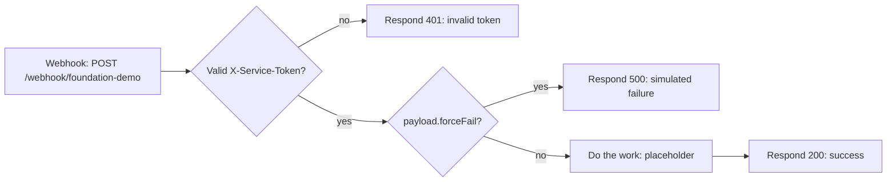
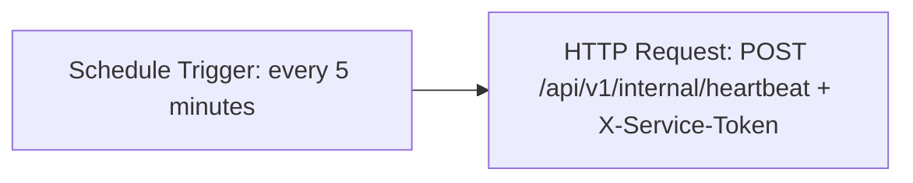
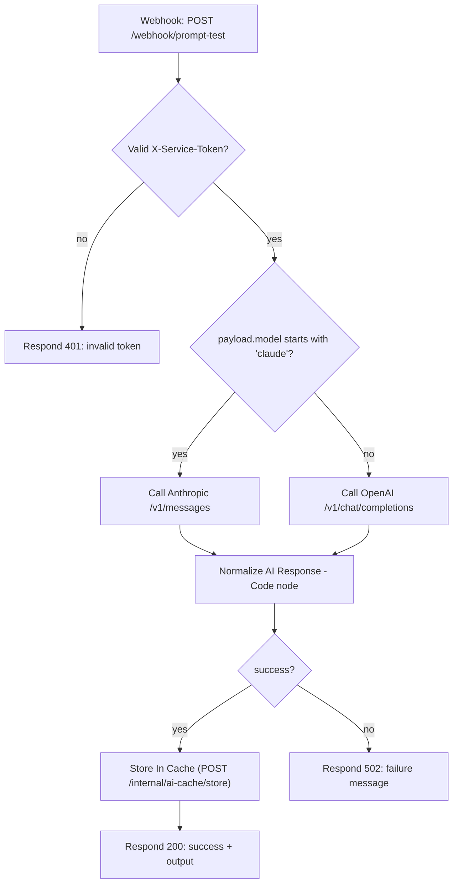

# n8n Workflows (Phase 6, Phase 7)

Diagrams for every workflow exported to `infra/n8n-workflows/`. Per `REPOSITORY_STRUCTURE.md`'s convention: never edit a workflow only in the n8n UI — export and commit the JSON, and update the matching diagram here, after every change.

## Architecture: how a job gets from `apps/api` to n8n and back

Business rules (retry counting, backoff scheduling, dead-letter transition, all persistence) live entirely in `apps/api/src/lib/queue.ts` — n8n only receives a webhook call and returns success/failure. This is deliberate: see the Phase 6 architecture constraint in `PROJECT_STATUS.md`.

## `foundation-demo.json` — base workflow template

Every future real business workflow (Video Discovery, AI Analysis, etc.) should follow this exact shape: validate the token first, do the actual work, and always end in an explicit `{success, message}` JSON response — the calling Worker's retry logic depends on that response shape, not on n8n's own execution status.

## `heartbeat.json` — scheduled liveness check

Runs entirely inside n8n's own scheduler (no BullMQ involved) — demonstrates the "scheduled jobs" and "n8n authenticating to the backend" requirements independently of the queue-mediated flow above. A gap in `job_logs` rows with `trigger_type='cron'` and `workflow_name='n8n-heartbeat'` over time is itself an observability signal.

## `prompt-test.json` — Phase 7 prompt test harness

Triggered by `POST /api/v1/admin/prompts/:name/test` (`PromptTestService`), one call per test run against a fixture video (`apps/api/test-fixtures/videos/`) — not on a schedule, and not part of the queue-mediated retry flow's business logic (this workflow's own failure still goes through the standard BullMQ retry/dead-letter path shown in the diagram above, since it's dispatched through the same `createWorkflowQueue` mechanism as every other workflow).

**TD-023 in `PROJECT_STATUS.md`:** this environment has no `ANTHROPIC_API_KEY`/`OPENAI_API_KEY` configured, so the actual AI-provider call cannot be live-verified end to end. Live-verified instead: the full pipeline up to and including that HTTP call — service-token auth, provider routing by `model` string, `continueOnFail` error capture, response normalisation, and the success/failure branch — by running it for real and observing the AI provider call fail with a predictable, correctly-surfaced error (`n8n webhook responded 502` in `job_logs`, followed by a genuine `dead_letter_jobs` row after the standard retry cycle exhausts). A cache-hit path was also verified: pre-populating `/internal/ai-cache/store` with the exact rendered input causes a second test run of the same prompt+fixture to return the cached output immediately, with no job enqueued.

## Deferred workflows

The 14 real business workflows ROADMAP.md lists for Phase 6 (Video Discovery, Metadata Pipeline, Transcript Pipeline, Thumbnail Analysis, AI Analysis Pipeline, Title Formula Detection, Hook Classification, Engagement Analytics, Viral Score Engine, Trend Detection, Opportunity Engine, Ethical Recommendation Engine, Channel Intelligence, Alert Dispatch) are **not built** — see TD-020 in `PROJECT_STATUS.md`. They need YouTube/Anthropic/OpenAI API keys this environment doesn't have, and RISK-01 (YouTube quota strategy) and RISK-02 (AI cost model) remain unresolved. `foundation-demo.json` is the template they'll each be built from once those are unblocked.
